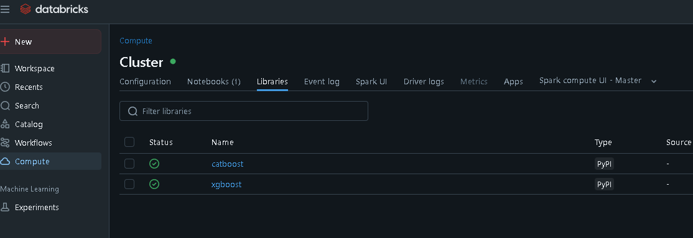

# 🏋️ Predict Calorie Expenditure  
**Kaggle Playground Series - Season 5, Episode 5**

This repository contains my solution for the Kaggle competition **"Playground Series - S5E5"**.  
The goal is to predict how many calories were burned during a workout session.

---

## 📝 Objective

Predict the number of **Calories** burned for each row in the test set.

### 🔢 Submission Format

The submission must be a CSV file with two columns: `id` and `Calories`. Example:

```
id,Calories
750000,93.2
750001,27.42
750002,103.8
```
---

## 📅 Timeline

- **Competition start**: May 1, 2025
- **Project Kickoff  | Initial exploration started**: May 19, 2025
- **Final submission deadline**: May 31, 2025 (11:59 PM UTC)

---

## ℹ️ Notes

- The dataset is **synthetically generated** but inspired by real-world data.  
- The competition is part of the **Kaggle Tabular Playground Series**, intended for learning and ex

---

## 🧰 Development Environment

This project was developed using **Databricks Community Edition**, combining **PySpark** and standard **Python** libraries.

To run the project successfully in Databricks:

1. Navigate to **Compute** → select the cluster you want to use  
2. Open the **Libraries** tab  
3. Click **Install New** → choose **PyPI**  
4. In the **Package** field, install:

```
xgboost
catboost
```


